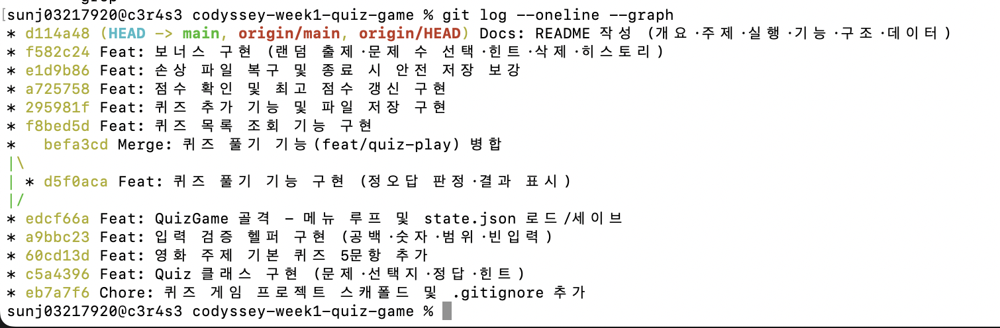

# 🎬 나만의 퀴즈 게임 — 영화 / 시네마

터미널에서 동작하는 영화 주제 퀴즈 게임. Python 기본 문법 + 객체지향(클래스) +
JSON 파일 영속성으로 구현했다. 프로그램을 종료했다가 다시 켜도 추가한 퀴즈와 최고
점수가 유지된다.

- **저장소:** `https://github.com/SSUNOWL/codyssey-week1-quiz-game` · 제출 브랜치: **`main`**
- **실행:** `python main.py` (Python 3.10 이상, 표준 라이브러리만 사용)

---

## 1. 프로젝트 개요

메뉴에서 번호를 선택하면 **퀴즈 풀기 / 추가 / 목록 / 점수 확인 / 삭제 / 종료**가
분기 실행되는 콘솔 프로그램이다. 개별 문제는 `Quiz` 클래스, 게임 전체 흐름은
`QuizGame` 클래스로 역할을 나눴고, 데이터는 프로젝트 루트 `state.json`에 UTF-8로
저장·복원한다. 잘못된 입력·강제 종료(Ctrl+C)·파일 손상 상황에서도 프로그램이
비정상 종료하지 않도록 방어 처리했다.

## 2. 퀴즈 주제 선정 이유 — 영화 / 시네마

- **누구나 아는 공통 화제**라 문제를 만들기도, 함께 즐기기도 쉽다. 감독·수상·캐릭터 등
  난이도(쉬움~어려움)를 자연스럽게 섞을 수 있어 퀴즈 주제로 적합하다.
- 봉준호(기생충)·제임스 카메론(타이타닉/아바타)처럼 **사실 기반의 명확한 정답**이
  존재해 정오답 판정이 애매하지 않다.
- 개인적으로 영화를 좋아해 문제 지문·힌트를 **직접 쓰기 즐거운** 주제였다.

## 3. 실행 방법

```bash
# 1) 저장소 클론
git clone https://github.com/SSUNOWL/codyssey-week1-quiz-game.git
cd codyssey-week1-quiz-game

# 2) 실행 (Python 3.10+)
python main.py

sunj03217920@c3r4s3 codyssey-week1-quiz-game % python main.py 
📂 저장된 데이터가 없어 기본 퀴즈로 시작합니다.

========================================
           🎬 나만의 퀴즈 게임 🎬
========================================
 1. 퀴즈 풀기
 2. 퀴즈 추가
 3. 퀴즈 목록
 4. 점수 확인
 5. 퀴즈 삭제
 6. 종료
========================================
선택: 1

몇 문제를 풀까요? (1-6): 2

📝 퀴즈를 시작합니다! (총 2문제, 무작위 출제)

----------------------------------------
[문제 1]
영화 '기생충'의 감독은?

  1. 박찬욱
  2. 봉준호
  3. 김기덕
  4. 이창동
정답 입력 (1-4, 힌트는 h): 2
✅ 정답입니다!

----------------------------------------
[문제 2]
마블 시네마틱 유니버스에서 타노스가 모은 인피니티 스톤의 개수는?

  1. 4개
  2. 5개
  3. 6개
  4. 7개
정답 입력 (1-4, 힌트는 h): h
💡 힌트: 색깔별로 하나씩, 손가락 개수와 같습니다.  (힌트를 보면 이 문제는 점수에서 제외됩니다)
정답 입력 (1-4, 힌트는 h): 3
✅ 정답이지만 힌트를 사용해 이 문제는 점수에 포함되지 않습니다.

========================================
🏆 결과: 2문제 중 1문제 정답! (50점)
🎉 새로운 최고 점수입니다!
========================================

sunj03217920@c3r4s3 codyssey-week1-quiz-game % python main.py
📂 저장된 데이터를 불러왔습니다. (퀴즈 6개, 최고점수 50점)

========================================
           🎬 나만의 퀴즈 게임 🎬
========================================
 1. 퀴즈 풀기
 2. 퀴즈 추가
 3. 퀴즈 목록
 4. 점수 확인
 5. 퀴즈 삭제
 6. 종료
========================================
선택: 2

📌 새로운 퀴즈를 추가합니다.
문제를 입력하세요: 스파이더맨영화의 주연배우는?
선택지 1: 톰 호랜드
선택지 2: 젠데이야
선택지 3: 톰 하디
선택지 4: 톰 히들스턴
정답 번호 (1-4): 1
힌트 (없으면 그냥 Enter): 톰으로 시작하는 배우
✅ 퀴즈가 추가되었습니다!

========================================
           🎬 나만의 퀴즈 게임 🎬
========================================
 1. 퀴즈 풀기
 2. 퀴즈 추가
 3. 퀴즈 목록
 4. 점수 확인
 5. 퀴즈 삭제
 6. 종료
========================================
선택: 3

📋 등록된 퀴즈 목록 (총 7개)
----------------------------------------
[1] 영화 '기생충'의 감독은?
[2] 마블 시네마틱 유니버스에서 타노스가 모은 인피니티 스톤의 개수는?
[3] 영화 '타이타닉'과 '아바타'를 연출한 감독은?
[4] 2020년 아카데미 시상식에서 작품상을 받은 영화는?
[5] 영화 '인터스텔라'에 등장하는 거대한 블랙홀의 이름은?
[6] 디즈니 애니메이션 '겨울왕국'에서 엘사의 여동생 이름은?
[7] 스파이더맨영화의 주연배우는?
----------------------------------------

========================================
           🎬 나만의 퀴즈 게임 🎬
========================================
 1. 퀴즈 풀기
 2. 퀴즈 추가
 3. 퀴즈 목록
 4. 점수 확인
 5. 퀴즈 삭제
 6. 종료
========================================
선택: 4

🏆 최고 점수: 50점

📜 최근 기록
----------------------------------------
  2026-07-28 20:30:34  |  2문제 중 1개 정답  |  50점
----------------------------------------

========================================
           🎬 나만의 퀴즈 게임 🎬
========================================
 1. 퀴즈 풀기
 2. 퀴즈 추가
 3. 퀴즈 목록
 4. 점수 확인
 5. 퀴즈 삭제
 6. 종료
========================================
선택: 5

📋 등록된 퀴즈 목록 (총 7개)
----------------------------------------
[1] 영화 '기생충'의 감독은?
[2] 마블 시네마틱 유니버스에서 타노스가 모은 인피니티 스톤의 개수는?
[3] 영화 '타이타닉'과 '아바타'를 연출한 감독은?
[4] 2020년 아카데미 시상식에서 작품상을 받은 영화는?
[5] 영화 '인터스텔라'에 등장하는 거대한 블랙홀의 이름은?
[6] 디즈니 애니메이션 '겨울왕국'에서 엘사의 여동생 이름은?
[7] 스파이더맨영화의 주연배우는?
----------------------------------------
삭제할 퀴즈 번호 (1-7): 2
🗑️  삭제되었습니다: 마블 시네마틱 유니버스에서 타노스가 모은 인피니티 스톤의 개수는?

========================================
           🎬 나만의 퀴즈 게임 🎬
========================================
 1. 퀴즈 풀기
 2. 퀴즈 추가
 3. 퀴즈 목록
 4. 점수 확인
 5. 퀴즈 삭제
 6. 종료
========================================
선택: 1

몇 문제를 풀까요? (1-6): 4

📝 퀴즈를 시작합니다! (총 4문제, 무작위 출제)

----------------------------------------
[문제 1]
영화 '기생충'의 감독은?

  1. 박찬욱
  2. 봉준호
  3. 김기덕
  4. 이창동
정답 입력 (1-4, 힌트는 h): 2
✅ 정답입니다!

----------------------------------------
[문제 2]
2020년 아카데미 시상식에서 작품상을 받은 영화는?

  1. 1917
  2. 조커
  3. 기생충
  4. 포드 V 페라리
정답 입력 (1-4, 힌트는 h): 3
✅ 정답입니다!

----------------------------------------
[문제 3]
영화 '타이타닉'과 '아바타'를 연출한 감독은?

  1. 스티븐 스필버그
  2. 제임스 카메론
  3. 크리스토퍼 놀란
  4. 리들리 스콧
정답 입력 (1-4, 힌트는 h): 2
✅ 정답입니다!

----------------------------------------
[문제 4]
영화 '인터스텔라'에 등장하는 거대한 블랙홀의 이름은?

  1. 가르강튀아
  2. 사건의 지평선
  3. 안드로메다
  4. 오디세이
정답 입력 (1-4, 힌트는 h): 1
✅ 정답입니다!

========================================
🏆 결과: 4문제 중 4문제 정답! (100점)
🎉 새로운 최고 점수입니다!
========================================

========================================
           🎬 나만의 퀴즈 게임 🎬
========================================
 1. 퀴즈 풀기
 2. 퀴즈 추가
 3. 퀴즈 목록
 4. 점수 확인
 5. 퀴즈 삭제
 6. 종료
========================================
선택: 6

👋 게임을 종료합니다. 이용해 주셔서 감사합니다!
sunj03217920@c3r4s3 codyssey-week1-quiz-game % 

```

> 외부 라이브러리 설치가 전혀 필요 없다(표준 라이브러리만 사용). 첫 실행 시
> `state.json`이 없으면 기본 영화 퀴즈 6문항으로 자동 시작한다.

## 4. 기능 목록

| 메뉴 | 기능 | 설명 |
|------|------|------|
| 1 | 퀴즈 풀기 | 문제 수 선택 → 무작위 출제 → 정오답 판정 → 결과·점수 표시 |
| 2 | 퀴즈 추가 | 문제·선택지 4개·정답 번호(+힌트) 입력 → `state.json`에 저장 |
| 3 | 퀴즈 목록 | 등록된 모든 문제를 번호와 함께 표시 (없으면 안내) |
| 4 | 점수 확인 | 최고 점수 + 최근 게임 기록 표시 (미플레이 시 안내) |
| 5 | 퀴즈 삭제 | 목록에서 번호를 골라 삭제 후 파일 반영 *(보너스)* |
| 6 | 종료 | 저장 후 안전하게 종료 |

**보너스(전부 구현):** ⭐ 랜덤 출제 · ⭐ 문제 수 선택 · ⭐ 힌트(사용 시 해당 문제
점수 제외) · ⭐ 퀴즈 삭제 · ⭐ 점수 기록 히스토리(날짜·문항 수·점수).

## 5. 파일 구조

```
codyssey-week1-quiz-game/
├─ main.py            # 진입점: UTF-8 설정, 실행 루프, Ctrl+C/EOF 안전 종료
├─ quiz.py            # Quiz 클래스: 문제·선택지4·정답·힌트 (+ 출력/정답확인/직렬화)
├─ quiz_game.py       # QuizGame 클래스: 메뉴·풀기·추가·목록·삭제·점수·저장/불러오기
├─ default_quizzes.py # 기본 영화 퀴즈 6문항 (Quiz 인스턴스로 생성)
├─ helpers.py         # 입력 검증 함수(공백·숫자변환·범위·빈입력 처리)
├─ state.json         # 런타임 데이터(첫 실행 시 자동 생성, .gitignore 대상)
├─ .gitignore
├─ README.md
└─ docs/screenshots/  # 실행 결과 스크린샷
```

- **클래스 2개**(`Quiz`, `QuizGame`)로 역할 분리 + 입력 로직은 `helpers.py`로 함수 분리.

## 6. 데이터 파일 설명 — `state.json`

- **경로:** 프로젝트 루트 `./state.json` (실행 위치 기준)
- **역할:** 퀴즈 목록·최고 점수·게임 기록을 저장해 **재시작 후에도 데이터 유지**
- **인코딩:** UTF-8 (`ensure_ascii=False`로 한글 그대로 저장)
- **없을 때:** 기본 퀴즈 6문항으로 시작 · **손상 시:** 안내 후 기본 데이터로 복구
- **버전 관리:** 런타임 데이터이므로 `.gitignore`로 제외(코드에 기본값 내장)

**스키마**

```json
{
  "quizzes": [
    { "question": "영화 '기생충'의 감독은?",
      "choices": ["박찬욱", "봉준호", "김기덕", "이창동"],
      "answer": 2,
      "hint": "2019년 칸 영화제 황금종려상 수상작입니다." }
  ],
  "best_score": 80,
  "history": [
    { "datetime": "2026-07-28 18:36:30", "total": 5, "correct": 4, "score": 80 }
  ]
}
```

| 키 | 의미 |
|----|------|
| `quizzes` | 퀴즈 목록(문제·선택지 4개·정답 번호 1~4·힌트) |
| `best_score` | 최고 점수(백분율). 아직 안 풀었으면 `null` |
| `history` | 게임 기록(날짜시간·문항 수·정답 수·점수) *(보너스)* |

---

## 7. 입력 / 예외 처리 (공통 기준 충족)

| 상황 | 처리 |
|------|------|
| 앞뒤 공백 | `strip()`으로 제거 후 처리 (예: `" 1 "` → `1`) |
| 숫자 아님(`abc`) | 안내 후 재입력 |
| 범위 밖(메뉴 `9`, 정답 `0`) | 안내 후 재입력 |
| 빈 입력(그냥 Enter) | 안내 후 재입력 |
| `Ctrl+C` / 입력 종료(EOF) | 안내 + 저장 후 안전 종료 |
| 데이터 파일 없음 | 기본 퀴즈로 시작 |
| 데이터 파일 손상 | 안내 후 기본 퀴즈로 복구 |

## 8. 학습 개념 정리 (코드 근거)

| 개념 | 코드 위치 | 한 줄 설명 |
|------|-----------|-----------|
| 변수·자료형(`int/str/bool/list/dict`) | 전반 | 점수(int)·문제(str)·선택지(list)·저장데이터(dict) 등으로 사용 |
| `if/elif/else` | `quiz_game.run()` | 메뉴 번호에 따라 다른 기능 분기 |
| `for` vs `while` | `play()`(for), `run()`/`read_int()`(while) | 개수가 정해진 반복은 for, 조건 반복은 while |
| 함수(매개변수·반환) | `helpers.read_int(prompt, low, high)` | 입력 검증을 함수로 분리·재사용 |
| 클래스(`__init__`·`self`) | `Quiz`, `QuizGame` | 데이터+동작을 한 단위로 묶어 역할 분리 |
| 파일 입출력·JSON·`try/except` | `QuizGame.load()/save()` | JSON으로 영속화, 손상 시 예외 처리로 복구 |

## 9. Git 워크플로우 (증거)

**전략:** 대부분 기능은 `main`에서 기능 단위 커밋, **퀴즈 풀기**만 `feat/quiz-play`
브랜치로 분기·작업 후 `main`에 **병합**. 마지막에 **clone/pull 실습**.

**커밋 그래프** (`git log --oneline --graph`)

```text
* f582c24 Feat: 보너스 구현 (랜덤 출제·문제 수 선택·힌트·삭제·히스토리)
* e1d9b86 Feat: 손상 파일 복구 및 종료 시 안전 저장 보강
* a725758 Feat: 점수 확인 및 최고 점수 갱신 구현
* 295981f Feat: 퀴즈 추가 기능 및 파일 저장 구현
* f8bed5d Feat: 퀴즈 목록 조회 기능 구현
*   befa3cd Merge: 퀴즈 풀기 기능(feat/quiz-play) 병합
|\
| * d5f0aca Feat: 퀴즈 풀기 기능 구현 (정오답 판정·결과 표시)
|/
* edcf66a Feat: QuizGame 골격 - 메뉴 루프 및 state.json 로드/세이브
* a9bbc23 Feat: 입력 검증 헬퍼 구현 (공백·숫자·범위·빈입력)
* 60cd13d Feat: 영화 주제 기본 퀴즈 5문항 추가
* c5a4396 Feat: Quiz 클래스 구현 (문제·선택지·정답·힌트)
* eb7a7f6 Chore: 퀴즈 게임 프로젝트 스캐폴드 및 .gitignore 추가
```

> 

**Git 7종 명령 사용 기록**

| 명령 | 사용처 |
|------|--------|
| `init` | 저장소 최초 생성 (`git init -b main`) |
| `add` / `commit` | 12개 기능 단위 커밋 |
| `checkout` | `git checkout -b feat/quiz-play` (기능 브랜치 생성) |
| `merge` | `git merge --no-ff feat/quiz-play` (main 병합) |
| `push` | GitHub `main` 업로드 (아래 슬롯) |
| `clone` / `pull` | 저장소 복제 실습 (아래 슬롯) |

**GitHub 최초 업로드** (실습 PC)

```bash
sunj03217920@c3r4s3 codyssey-week1-quiz-game % git push origin main
Everything up-to-date

```

**clone / pull 실습** (실습 PC)

```bash
sunj03217920@c4r6s7 Desktop % git clone https://github.com/SSUNOWL/codyssey-week1-quiz-game
Cloning into 'codyssey-week1-quiz-game'...
remote: Enumerating objects: 57, done.
remote: Counting objects: 100% (57/57), done.
remote: Compressing objects: 100% (28/28), done.
remote: Total 57 (delta 27), reused 55 (delta 25), pack-reused 0 (from 0)
Receiving objects: 100% (57/57), 401.59 KiB | 57.37 MiB/s, done.
Resolving deltas: 100% (27/27), done.
sunj03217920@c4r6s7 Desktop % mkdir codyssey-week1-quiz-game-clone
sunj03217920@c4r6s7 Desktop % cd codyssey-week1-quiz-game-clone/c
cd: no such file or directory: codyssey-week1-quiz-game-clone/c
sunj03217920@c4r6s7 Desktop % cd codyssey-week1-quiz-game-clone  
sunj03217920@c4r6s7 codyssey-week1-quiz-game-clone % ls
sunj03217920@c4r6s7 codyssey-week1-quiz-game-clone % git clone https://github.com/SSUNOWL/codyssey-week1-quiz-game
Cloning into 'codyssey-week1-quiz-game'...
remote: Enumerating objects: 57, done.
remote: Counting objects: 100% (57/57), done.
remote: Compressing objects: 100% (28/28), done.
remote: Total 57 (delta 27), reused 55 (delta 25), pack-reused 0 (from 0)
Receiving objects: 100% (57/57), 401.59 KiB | 50.20 MiB/s, done.
Resolving deltas: 100% (27/27), done.
sunj03217920@c4r6s7 codyssey-week1-quiz-game-clone % ls 
codyssey-week1-quiz-game
sunj03217920@c4r6s7 codyssey-week1-quiz-game-clone % cd codyssey-week1-quiz-game 
sunj03217920@c4r6s7 codyssey-week1-quiz-game % echo " " >> README.md
sunj03217920@c4r6s7 codyssey-week1-quiz-game % git commit -am "Docs: clone 실습용 README 수정"
[main 0c2391b] Docs: clone 실습용 README 수정
 Committer: 김선재 <sunj03217920@c4r6s7.codyssey.kr>
Your name and email address were configured automatically based
on your username and hostname. Please check that they are accurate.
You can suppress this message by setting them explicitly. Run the
following command and follow the instructions in your editor to edit
your configuration file:

    git config --global --edit

After doing this, you may fix the identity used for this commit with:

    git commit --amend --reset-author

 1 file changed, 1 insertion(+)
sunj03217920@c4r6s7 codyssey-week1-quiz-game % git push
Enumerating objects: 5, done.
Counting objects: 100% (5/5), done.
Delta compression using up to 6 threads
Compressing objects: 100% (3/3), done.
Writing objects: 100% (3/3), 341 bytes | 341.00 KiB/s, done.
Total 3 (delta 2), reused 0 (delta 0), pack-reused 0 (from 0)
remote: Resolving deltas: 100% (2/2), completed with 2 local objects.
To https://github.com/SSUNOWL/codyssey-week1-quiz-game
   180f954..0c2391b  main -> main
sunj03217920@c4r6s7 codyssey-week1-quiz-game % cd ..
sunj03217920@c4r6s7 codyssey-week1-quiz-game-clone % cd ..
sunj03217920@c4r6s7 Desktop % cd ../codyssey-week1-quiz-game
cd: no such file or directory: ../codyssey-week1-quiz-game
sunj03217920@c4r6s7 Desktop % cd codyssey-week1-quiz-game
sunj03217920@c4r6s7 codyssey-week1-quiz-game % git pull
remote: Enumerating objects: 5, done.
remote: Counting objects: 100% (5/5), done.
remote: Compressing objects: 100% (1/1), done.
remote: Total 3 (delta 2), reused 3 (delta 2), pack-reused 0 (from 0)
Unpacking objects: 100% (3/3), 321 bytes | 107.00 KiB/s, done.
From https://github.com/SSUNOWL/codyssey-week1-quiz-game
   180f954..0c2391b  main       -> origin/main
Updating 180f954..0c2391b
Fast-forward
 README.md | 1 +
 1 file changed, 1 insertion(+)
sunj03217920@c4r6s7 codyssey-week1-quiz-game % 

```

<details><summary>실행 출력 붙여넣기</summary>

```text
(clone / push / pull 출력 붙여넣기)
```
</details>

## 10. 실행 결과 스크린샷 (실습 PC 캡처)

| 화면 | 파일 |
|------|------|
| 메뉴 | `docs/screenshots/1.%20퀴즈%20메뉴.png` |
| 퀴즈 풀기 | `docs/screenshots/2.퀴즈%20풀기.png` |
| 퀴즈 풀기 | `docs/screenshots/3.%20퀴즈%20풀기.png` |
| 퀴즈 추가 | `docs/screenshots/4.%20퀴즈%20만들기.png` |
| 점수 확인 | `docs/screenshots/5.%20점수%20확인.png` |
| 개발 환경(파이썬 버전·Git 설정) | `docs/screenshots/6.%20실행환경.png` |


## 11. 트러블슈팅

### 1) 저장 파일(`state.json`)이 손상되면 다음 실행이 통째로 종료됨
- **문제:** 저장 형식을 확인하려고 `state.json`을 직접 열어 값을 고치다가(따옴표를
  빠뜨리는 등) 저장했더니, 다음번 `python main.py` 실행 때 프로그램이 시작하자마자
  `json.JSONDecodeError`를 내며 게임에 들어가지도 못하고 종료됐다.
- **원인:** `load()`가 파일 내용을 그대로 `json.load()`로 신뢰해 파싱하다 보니, 형식이
  조금만 어긋나도 예외가 그대로 위로 전파돼 프로그램 전체가 비정상 종료됐다.
- **해결:** `load()`를 `try/except (json.JSONDecodeError, OSError, ValueError, KeyError,
  TypeError)`로 감싸, 손상을 감지하면 안내 메시지를 출력하고 `_use_defaults()`로 기본
  퀴즈로 복구하도록 했다. 이제 파일이 깨져 있어도 게임은 항상 실행된다. (`quiz_game.py`의 `load()`)

### 2) 게임 도중 Ctrl+C로 끄면 트레이스백이 뜨고 저장이 보장되지 않음
- **문제:** 메뉴나 정답 입력을 기다리는 중 `Ctrl+C`로 종료했더니, 빨간
  `KeyboardInterrupt` 트레이스백이 그대로 노출되며 비정상 종료됐다. 정상 종료(메뉴 6번)와
  달리 저장 단계를 거치지 않아 진행 중이던 상태가 저장된다는 보장도 없었다.
- **원인:** `input()` 대기 중 발생하는 `KeyboardInterrupt`(Ctrl+C)와 `EOFError`(입력 종료)가
  아무 데서도 처리되지 않고 최상위까지 전파됐다.
- **해결:** `main.py`에서 `game.run()`을 `try/except (KeyboardInterrupt, EOFError)`로 감싸,
  중단 신호가 와도 안내 문구를 출력하고 `game.save()`로 현재 상태를 저장한 뒤 깔끔하게
  종료하도록 했다. (`main.py`)

## 12. 수행 체크리스트

- [x] 메뉴 분기(풀기/추가/목록/점수/삭제/종료) + 잘못된 입력 처리
- [x] `Quiz` 클래스(문제·선택지4·정답1~4·힌트) + 출력/정답확인 메서드
- [x] 기본 영화 퀴즈 6문항(5개 이상)
- [x] 퀴즈 풀기(정오답·결과) — `feat/quiz-play` 브랜치 → `main` 병합
- [x] 퀴즈 추가/목록/점수(최고점수 갱신·저장)
- [x] `state.json` 저장·불러오기 + 없음/손상 복구
- [x] 공통 입력/예외 + Ctrl+C·EOF 안전 종료
- [x] 커밋 12개(+병합) · 브랜치+병합 · 7종 명령
- [x] 보너스 5종(랜덤·문항수·힌트·삭제·히스토리)
- [x] (실습 PC) push · clone/pull 출력 + 스크린샷 6종 삽입
  
 
 
